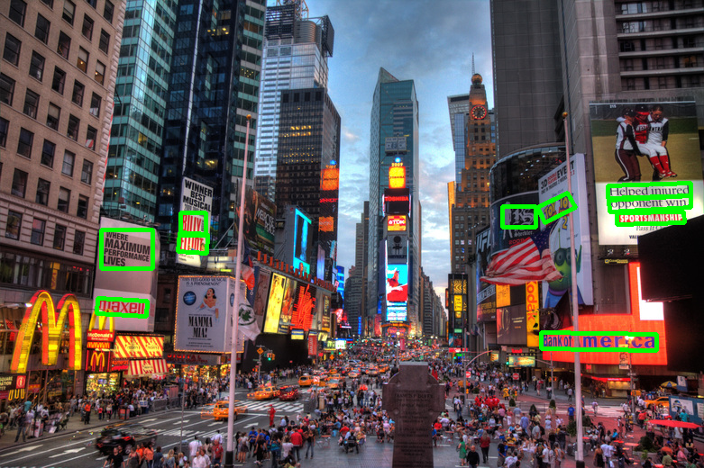

# Simple photo signature watermark detection using PyTorch CRAFT text detector

The photo is obviously signed. But how to automate the detection?

## Text detection

Yes this photo of Times Square does include multiple texts. Only text in the wild. No signature was added.
## CRAFT detector

Detecting texts is a challenge. Following paper does provide a consistent approach : _Character Region Awareness for Text Detection_, 2019, https://arxiv.org/abs/1904.01941

For Python we can use this PyTorch implementation : https://github.com/fcakyon/craft-text-detector

Installation cannot be simpler :

    pip install craft-text-detector imageio

How to use? Just create the engine:

    craft = Craft(output_dir='output', crop_type="box")

And run the detection, providing a batch of images :

    result = craft.detect_text([ image])

The result holds a list of bounding boxes for the detected text regions for every image.

## Telling signature text from text in the wild
You may come up with a more advanced solution. For the moment we can use a simple region-based decision.

We state that a signature most often is located in a corner. Or at very top or bottom of the image.

You may refer to [Where do I place my watermark](https://photologo.co/where-do-i-place-my-watermark).

We can traverse the list of detected text bounding boxes. And if *any* of them happen to be *completely* inside the mask we consider it to be a signature...

  

## Run the demo tests

    python -m unittest craft_test.py
